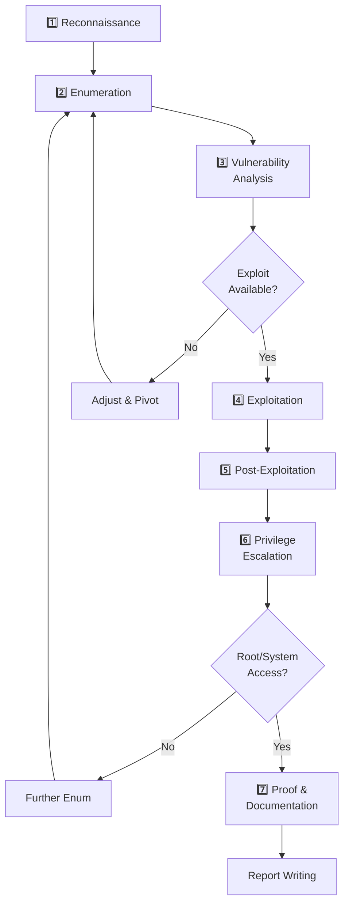

# 🗺️ Penetration Testing Methodology

> [!info] The OSCP Methodology
> This is the **proven framework** for approaching OSCP exam machines. Follow this religiously. Speed comes from consistency, not cutting corners.

---

## 🎯 Overview: The 7-Phase Attack Chain



---

## Phase 1️⃣: Reconnaissance

**Objective:** Gather intel without touching the target system. PASSIVE reconnaissance only.

### What You're Doing
- Mapping the attack surface
- Identifying technologies in use
- Finding entry points
- Understanding network topology

### Techniques (Passive)
```bash
# OSINT: Google, Shodan, DNS records (if external target)
# Whois: Domain registration info
# LinkedIn: Employee enumeration
# GitHub: Source code leaks, credentials

# For OSCP internal lab: this phase is minimal
# Focus on active enumeration instead
```

### Time Allocation
⏱️ **5-10 minutes** (passive OSINT)  
⏱️ **20-30 minutes** (if external/grey-box)

> [!tip] Lab Reconnaissance
> In OSCP labs, you have direct access. Spend minimal time here; move to active enumeration.

---

## Phase 2️⃣: Enumeration (THE MOST CRITICAL PHASE)

**Objective:** Map every open port, service version, and potential vulnerability.

> [!warning] 50% RULE
> Spend **50% of your time** on enumeration. This is where exam failures happen — you miss a service because you didn't scan properly.

### Step 1: Network Scanning (Nmap)

```bash
# Quick SYN scan (recommended for speed)
nmap -sS -p- -T4 --open -oN initial.txt TARGET

# Better: with service detection
nmap -sS -p- -sV -sC -T4 --open -oN nmap_full.txt TARGET

# Aggressive scan (if time permits)
nmap -A -p- -T4 -oN nmap_aggressive.txt TARGET

# UDP scan (don't skip!)
nmap -sU -p- -sV -T4 --open -oN nmap_udp.txt TARGET

# Fast scan for all ports with minimal info
rustscan -a TARGET -- -sV -sC
```

### Step 2: Service-Specific Enumeration

For each open port, run detailed scans:

```bash
# HTTP/HTTPS (ports 80, 8080, 8443, 9000, etc.)
## Nikto web scanner
nikto -h http://TARGET:PORT

## Gobuster directory brute-force
gobuster dir -u http://TARGET:PORT -w /usr/share/wordlists/dirb/common.txt -o gobuster.txt

## Feroxbuster (faster, recursive)
feroxbuster -u http://TARGET:PORT -w /usr/share/seclists/Discovery/Web-Content/big.txt

## Check for vulnerable HTTP methods
curl -v -X OPTIONS http://TARGET:PORT

# FTP (port 21)
nmap -sV -p 21 --script ftp-anon,ftp-bounce TARGET

# SMB (port 139, 445) — CRITICAL FOR WINDOWS
nmap -sV -p 139,445 --script smb-enum-shares,smb-enum-users,smb-os-discovery TARGET
smbclient -L //TARGET -N

# SSH (port 22)
ssh-audit TARGET

# RDP (port 3389)
# Look for CVE-2019-0604, check for null sessions

# LDAP (port 389, 636)
ldapsearch -x -h TARGET -b "dc=<domain>,dc=<tld>"

# SQL (port 1433 MSSQL, 3306 MySQL, 5432 PostgreSQL)
# Try default credentials first
sqlmap -u "http://TARGET/page?id=1" --batch --dbs
```

### Step 3: Vulnerability Assessment

| Port | Service | Scan Commands |
|------|---------|---------------|
| **21** | FTP | `nmap -sV --script ftp-anon,ftp-bounce` |
| **22** | SSH | `ssh-audit`, check banner for version |
| **25** | SMTP | `nmap -sV --script smtp-enum-users` |
| **53** | DNS | `nslookup`, `dig`, `dnsrecon` |
| **80/443** | HTTP/HTTPS | `nikto`, `gobuster`, `feroxbuster`, `wfuzz` |
| **110/995** | POP3 | `nmap -sV --script pop3-capabilities` |
| **139/445** | SMB | `smbclient -L`, `enum4linux`, `smbmap` |
| **389/636** | LDAP | `ldapsearch`, `ldapdomaindump` |
| **1433** | MSSQL | `nmap -sV --script ms-sql-info` |
| **3306** | MySQL | `mysql -h TARGET -u root` |
| **3389** | RDP | `nmap -sV --script rdp-enum-encryption` |
| **5432** | PostgreSQL | `psql -h TARGET -U postgres` |
| **5900** | VNC | `vncviewer TARGET`, check for default creds |

### Time Allocation
⏱️ **30-45 minutes** for initial scans  
⏱️ **30-60 minutes** for deep service enumeration

---

## Phase 3️⃣: Vulnerability Analysis

**Objective:** Identify exploitable weaknesses from enumeration data.

### Analysis Checklist

- [ ] Check all service versions against known CVEs
- [ ] Look for misconfigurations (default creds, open shares)
- [ ] Identify weak permissions (world-readable files)
- [ ] Check for known vulnerable software
- [ ] Note all potential entry vectors
- [ ] Prioritize by exploitability

### Tools for CVE Lookup
```bash
# searchsploit: local Exploit-DB mirror
searchsploit apache 2.4.41

# Google + GitHub
google: "CVE-2021-12345 exploit"

# Metasploit
msfconsole
> search apache 2.4
```

### Time Allocation
⏱️ **10-15 minutes**

---

## Phase 4️⃣: Exploitation

**Objective:** Gain initial access (user-level shell).

### Attack Vectors (Prioritize This Order)

1. **Web vulnerabilities** (RCE > SQLi > LFI)
   - Check web application code for injection flaws
   - Try common upload bypasses
   
2. **Known CVEs** (searchsploit, msfconsole)
   - Use public exploits when available
   - Customize as needed

3. **Brute force** (last resort)
   - SSH password spray
   - HTTP form brute force
   - SMB null session → share access

4. **Misconfigurations**
   - Anonymous FTP uploads
   - Default credentials (tomcat, webmin, etc.)
   - World-readable source code

### Gaining Initial Shell

```bash
# If web RCE found, get reverse shell
# (see 💀 Shells & Payloads for payloads)

# If exploit available
searchsploit -m python/remote/12345.py
python exploit.py TARGET

# If credentials found
ssh user@TARGET -p PORT
# or
psql -h TARGET -U postgres
```

### Time Allocation
⏱️ **20-40 minutes** (highly variable)

---

## Phase 5️⃣: Post-Exploitation

**Objective:** Stabilize your shell and gather local info for privilege escalation.

```bash
# Stabilize reverse shell (Ctrl+C safe)
python -c 'import pty; pty.spawn("/bin/bash")'
export TERM=xterm

# Create SSH key access (if possible)
echo "ssh-rsa YOUR_KEY" >> ~/.ssh/authorized_keys

# Gather local intelligence
## System info
uname -a
cat /etc/os-release
whoami
id
hostname

## Network info
ip addr
ip route
netstat -tulpn
ss -tulpn

## Users
cat /etc/passwd | grep bash
cat /etc/shadow  # if readable

## Sudo permissions
sudo -l

## File system
df -h
mount

## Process list
ps aux

## Network connections
netstat -tulpn
ss -tulpn
```

### Time Allocation
⏱️ **5-10 minutes**

---

## Phase 6️⃣: Privilege Escalation

**Objective:** Elevate from user to root/system.

### Linux Privilege Escalation Vectors
[[02-Linux/Linux-Privesc|📖 Full Linux Privesc Guide]]

Quick checklist:
1. [ ] [[#SUID Binaries]]
2. [ ] [[#Sudo Misconfigurations]]
3. [ ] [[#Cron Jobs]]
4. [ ] [[#Weak File Permissions]]
5. [ ] [[#Kernel Exploits]]
6. [ ] [[#Docker/Container Escape]]

### Windows Privilege Escalation Vectors
[[03-Windows/Windows-Privesc|📖 Full Windows Privesc Guide]]

Quick checklist:
1. [ ] [[#Token Abuse (SeImpersonate)]]
2. [ ] [[#Unquoted Service Paths]]
3. [ ] [[#DLL Hijacking]]
4. [ ] [[#Registry Writable Permissions]]
5. [ ] [[#Kernel Exploits]]

### Time Allocation
⏱️ **30-90 minutes** (longest phase)

---

## Phase 7️⃣: Proof & Documentation

**Objective:** Collect proof files and prepare for report submission.

### Proof File Collection

```bash
# On Linux
cat /root/proof.txt
cat /root/local.txt  # if separate

# On Windows
type C:\Users\Administrator\Desktop\proof.txt
```

### Screenshot Requirements

For each machine, take screenshots of:
1. ✅ Proof file (`proof.txt` or similar)
2. ✅ `whoami` or `id` command output
3. ✅ `hostname` or `ipconfig` command output
4. ✅ First successful command after exploitation
5. ✅ Privilege escalation proof (running as root/system)

### Time Allocation
⏱️ **5 minutes**

---

## ⏱️ Total Time Per Machine

| Phase | Time | Notes |
|-------|------|-------|
| Recon | 10 min | Passive |
| Enumeration | 60 min | 50% of total time |
| Vulnerability Analysis | 15 min | Research CVEs |
| Exploitation | 30 min | Can be 5-120 min |
| Post-Exploitation | 10 min | Stabilize shell |
| Privilege Escalation | 60 min | Longest and hardest |
| **TOTAL** | **185 min** | ~3 hours (target) |
| Proof & Report | 15 min | Must be perfect |

> [!warning] Exam Time Budget (23h 45min total)
> - **Machine 1:** 4-5 hours (easiest)
> - **Machine 2:** 4-5 hours (medium)
> - **Machine 3:** 4-5 hours (hard)
> - **Network:** 5-8 hours (complex)
> - **Report Writing:** 2-3 hours
> - **Breaks & Contingency:** 2-3 hours

---

## 🚨 When You Get Stuck

1. **"I found a vulnerability but the exploit doesn't work"**
   - Verify you're targeting the right service version
   - Read the exploit code carefully
   - Check for required libraries
   - Try manual exploitation

2. **"I can't find any vulnerabilities"**
   - You probably missed something in enumeration
   - Re-run nmap with different flags
   - Check for information disclosure
   - Try default credentials on each service
   - Look for OSINT leaks

3. **"I have a shell but can't escalate"**
   - Run automated scripts (linPEAS, winPEAS)
   - Check for **soft targets**: write-accessible files, world-readable configs
   - Review running processes
   - Check cron/scheduled tasks
   - Look for misconfigured services
   - Try kernel exploits as last resort

4. **"I'm out of time"**
   - Document what you found (partial credit)
   - Move to another machine
   - Return with fresh perspective
   - Time management > perfection

---

## 📋 Pre-Machine Checklist

- [ ] Nmap initial scan started
- [ ] VPN connected to correct network
- [ ] Proof file format understood
- [ ] Screenshot tool ready
- [ ] Notepad/document open for notes
- [ ] Coffee/water nearby
- [ ] No distractions (phone, Slack, browser)

---

## 🎓 Common Exam Mistakes

❌ **Wrong:** Skipping enumeration  
✅ **Right:** 50% time on enumeration

❌ **Wrong:** Tunnel vision on one machine  
✅ **Right:** Try all 3 machines, pick easiest first

❌ **Wrong:** Forgetting to screenshot proof  
✅ **Right:** Screenshot immediately after proof.txt

❌ **Wrong:** Testing exploits during exam  
✅ **Right:** Test everything in lab before exam

---

## 💡 Pro Tips

> [!tip] The 2-Machine Strategy
> If stuck on one machine for >90 minutes, move to another. Your brain needs fresh challenges.

> [!tip] Documentation is Key
> Even if you don't root a machine, document:
> - What you found
> - What you tried
> - Why it failed
> - Partial credit points

> [!tip] Network Machine Hint
> The network machine often has a **pivot point**. Find the first compromised host, then chain your way through the network.

> [!info] Exam Mindset
> "Slow is smooth, smooth is fast." Methodology > speed.

---

**Related Notes:**
- [[02-Linux/Linux-Privesc|🐧 Linux Privilege Escalation]]
- [[03-Windows/Windows-Privesc|🪟 Windows Privilege Escalation]]
- [[01-Methodology/Recon-and-Enumeration|🔍 Recon & Enumeration]]
- [[05-Tools/Nmap-Cheatsheet|🎯 Nmap Cheatsheet]]

---
