# ⚔️ Professional Penetration Testing Kill Chain

> [!info] Visual Attack Methodology
> Complete cyber kill chain framework for professional penetration testing engagements. Shows attack flow from reconnaissance through actions on objectives.

---

## 🗺️ Complete Attack Chain Overview

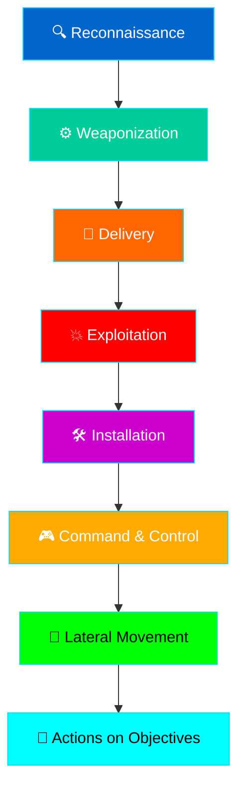

---

## 📍 Phase 1: Reconnaissance

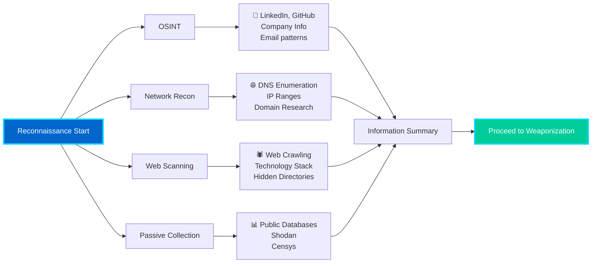

**Key Activities:**
- [ ] Target identification
- [ ] Domain enumeration
- [ ] Email discovery
- [ ] Technology fingerprinting
- [ ] Social media profiling
- [ ] DNS/IP reconnaissance

**Tools:** Shodan, theHarvester, DNSDumpster, Censys, SpiderFoot

---

## ⚙️ Phase 2: Weaponization

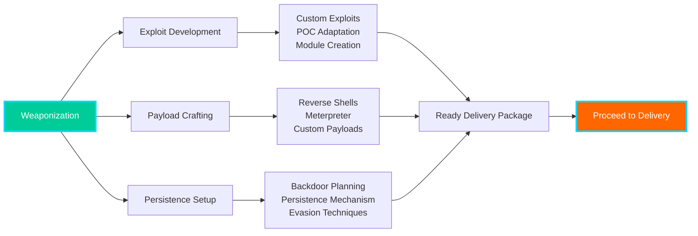

**Key Activities:**
- [ ] Exploit research
- [ ] Payload generation
- [ ] Obfuscation planning
- [ ] Persistence mechanisms
- [ ] Staging setup

**Tools:** Metasploit, CobaltStrike, Custom Scripts, msfvenom

---

## 📨 Phase 3: Delivery

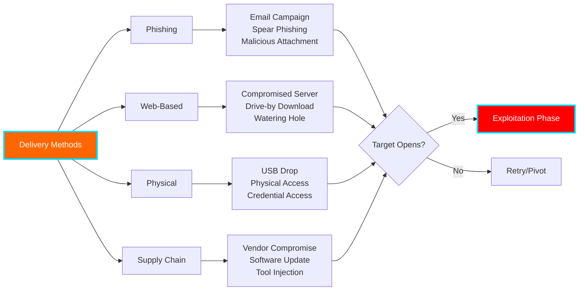

**Delivery Options by Risk:**
| Method | Risk | Detection | Effectiveness |
|--------|------|-----------|---|
| Phishing | High | High | 80-90% |
| Web-Based | Medium | Medium | 70-80% |
| Physical | Low | Low | 95%+ |
| Supply Chain | Low | Low | 100% |

---

## 💥 Phase 4: Exploitation

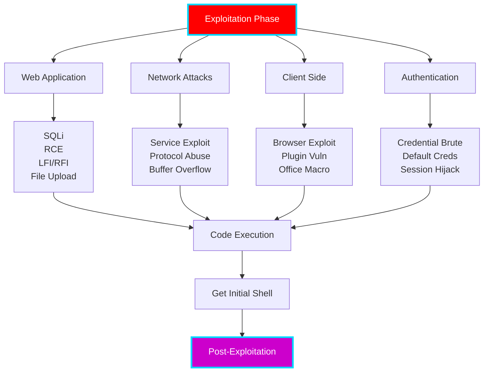

**Exploitation Priority (by success rate):**
1. **SQL Injection** (80% success) → Direct database access
2. **Default Credentials** (85% success) → Quick access
3. **Command Injection** (75% success) → Code execution
4. **File Upload** (70% success) → Shell placement
5. **Buffer Overflow** (40% success) → Advanced technique

**Tools:** sqlmap, Burp Suite, Metasploit, Custom Scripts

---

## 🛠️ Phase 5: Installation

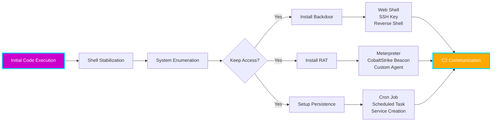

**Installation Checklist:**
- [ ] Stabilize shell (TTY upgrade)
- [ ] Create hidden user/account
- [ ] Install backdoor
- [ ] Setup persistence
- [ ] Test re-access
- [ ] Document credentials

---

## 🎮 Phase 6: Command & Control

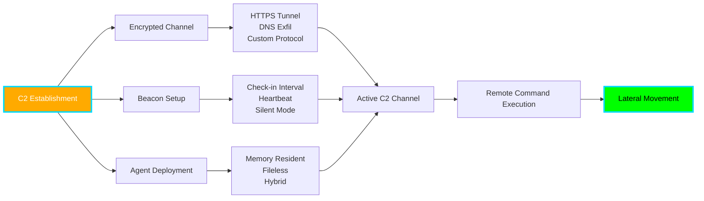

**C2 Techniques:**
- Encrypted communication channels
- Domain fronting for evasion
- Sleep obfuscation to avoid detection
- Multiple fallback channels

---

## 🌉 Phase 7: Lateral Movement

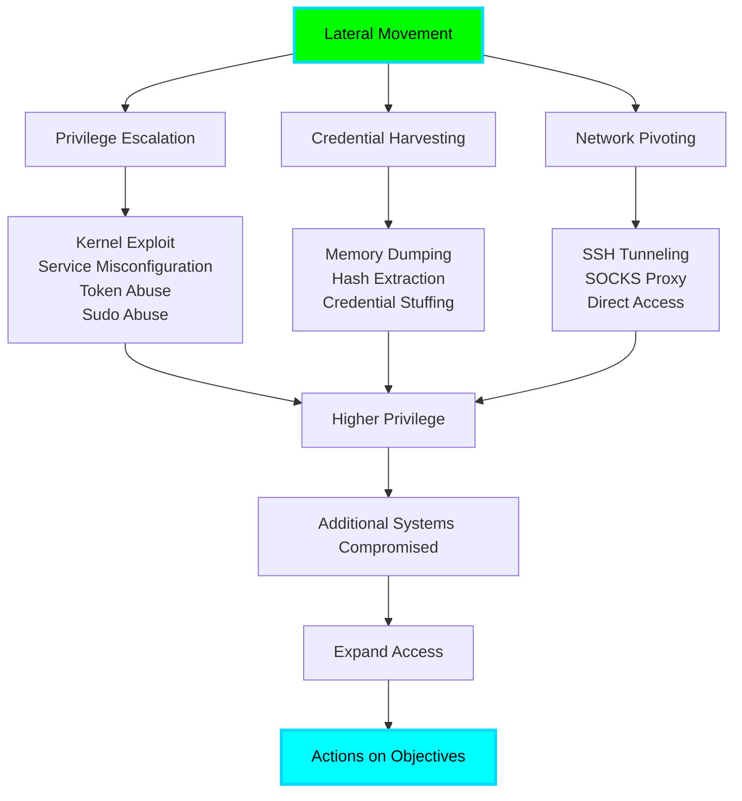

**Lateral Movement Priority:**
| Target | Effort | Payoff | Difficulty |
|--------|--------|--------|---|
| File Servers | Low | High | Easy |
| Domain Controllers | High | Critical | Hard |
| Management Tools | Medium | High | Medium |
| Database Servers | Medium | Critical | Medium |
| Backup Systems | Low | Critical | Easy |

---

## 💾 Phase 8: Actions on Objectives

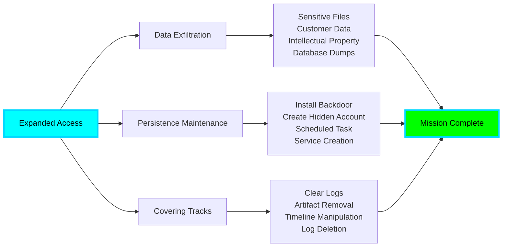

**Critical Actions:**
- [ ] Exfiltrate target data
- [ ] Establish persistence for future access
- [ ] Remove evidence of compromise
- [ ] Document findings
- [ ] Prepare remediation report

---

## 🔄 Alternative Attack Path: Web-Based Direct Access

**Web-Based Attack Timeline:**
- Reconnaissance: 15-30 min
- SQLi exploitation: 30-60 min
- Web shell upload: 10-20 min
- Code execution: 5-10 min
- Privilege escalation: 30-120 min
- Exfiltration: 20-60 min
- **Total: 2-5 hours**

---

## 🔄 Alternative Attack Path: Windows Domain Compromise

```mermaid
graph LR
    A[Initial Access] --> B[Windows System]
    B --> C[Credential<br/>Harvesting]
    C --> D[Domain User<br/>Found]
    D --> E[Lateral Movement<br/>to Domain]
    E --> F[Kerberoasting]
    F --> G[Service Account<br/>Cracked]
    G --> H[Domain Admin<br/>Rights Gained]
    H --> I[DCSync Attack]
    I --> J[Extract KRBTGT<br/>Hash]
    J --> K[Golden Ticket]
    K --> L[Domain Compromise<br/>Complete]
    
    style A fill:#ff0000,stroke:#00d9ff,color:#fff
    style C fill:#ff6600,stroke:#00d9ff,color:#fff,stroke-width:3px
    style H fill:#cc00cc,stroke:#00d9ff,color:#fff,stroke-width:3px
    style L fill:#00ff00,stroke:#00d9ff,color:#000,stroke-width:3px
```

**AD Compromise Timeline:**
- Initial access: 30-120 min
- User enumeration: 10-20 min
- Credential harvesting: 20-40 min
- Kerberoasting: 30-60 min
- Cracking: 10-120 min (depends on password)
- Escalation: 10-20 min
- **Total: 2-6 hours**

---

## 🎯 Decision Trees

### Which Exploitation Path?

```mermaid
graph TD
    A{What's exposed?} 
    
    A -->|Web Application| B{What type?}
    B -->|Input Field| C[Try SQL Injection]
    B -->|File Parameter| D[Try LFI/RFI]
    B -->|Upload Form| E[Try File Upload]
    
    A -->|Network Service| F{Windows or Linux?}
    F -->|Windows| G[Check SMB<br/>RDP<br/>MSSQL]
    F -->|Linux| H[Check SSH<br/>HTTP<br/>Custom Service]
    
    A -->|Authentication| I[Try Default Creds]
    I -->|Success| J[Initial Access]
    I -->|Fail| K[Try Brute Force]
    
    C --> L{RCE Possible?}
    D --> L
    E --> L
    L -->|Yes| M[Get Shell!]
    L -->|No| N[Data Access Only]
    
    style A fill:#ff6600,stroke:#00d9ff,color:#fff
    style M fill:#ff0000,stroke:#00d9ff,color:#fff,stroke-width:3px
```

---

## 📋 Complete Attack Checklist

### Pre-Engagement
- [ ] Rules of Engagement signed
- [ ] Scope documented
- [ ] Testing window confirmed
- [ ] Emergency contacts listed

### Reconnaissance Phase
- [ ] OSINT completed
- [ ] Domain information gathered
- [ ] Network ranges identified
- [ ] Technology stack documented

### Active Testing Phase
- [ ] Scanning completed without detection
- [ ] Vulnerabilities prioritized
- [ ] Exploitation plans created
- [ ] Backup plans developed

### Post-Exploitation
- [ ] Access confirmed and documented
- [ ] Data confirmed accessible
- [ ] Persistence tested (if authorized)
- [ ] Lateral movement paths mapped
- [ ] Remediation recommendations prepared

### Cleanup & Reporting
- [ ] Artifacts removed
- [ ] Systems restored
- [ ] Evidence collected for report
- [ ] Screenshots organized
- [ ] Timeline documented

---

## 🔗 Related Notes

- [[01-Methodology/Pentest-Methodology|🗺️ Pentest Methodology]]
- [[02-Linux/Linux-Privesc|🐧 Linux Privilege Escalation]]
- [[03-Windows/Windows-Privesc|🪟 Windows Privilege Escalation]]
- [[03-Windows/Active-Directory|👑 Active Directory Attacks]]
- [[04-Web/Web-Vulnerabilities|🌐 Web Vulnerabilities]]

---

**Last Updated:** 2026-04-30  
**Difficulty:** ★★★★☆ (Advanced)  
**Status:** 🟢 Complete Reference

---
