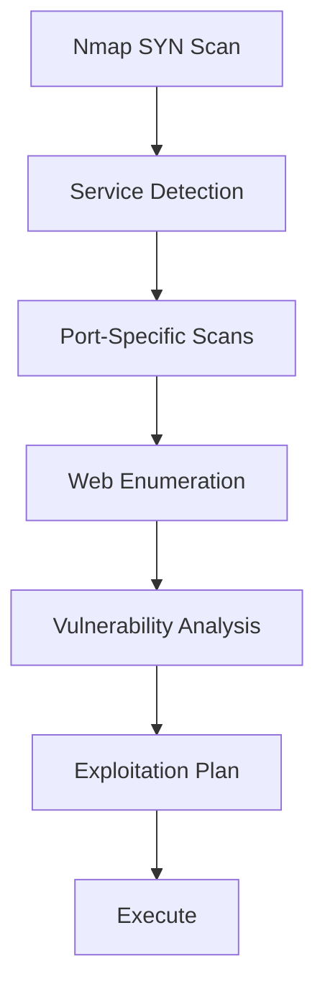

# 🔍 Reconnaissance & Enumeration

> [!info] The Golden Rule
> **50% of exam time should be enumeration.** Slow enumeration = fast exploitation.

---

## 📊 Enumeration Workflow



---

## 🎯 Nmap Scanning Strategy

### Initial Fast Scan

```bash
# All ports, minimal output
nmap -sS -p- -T4 --open -oN initial.txt TARGET

# Better: includes service detection
nmap -sS -p- -sV -T4 --open -oN nmap_quick.txt TARGET
```

### Comprehensive Scan

```bash
# Full enumeration with scripts
nmap -A -p- -sC -sV -T4 -oN nmap_full.txt TARGET

# Save in multiple formats
nmap -A -p- -sC -sV -T4 -oN nmap.txt -oX nmap.xml -oG nmap.gnmap TARGET
```

### UDP Scanning (Don't Skip!)

```bash
# Top 1000 UDP ports
nmap -sU -sV -T4 --top-ports 1000 -oN nmap_udp.txt TARGET

# Specific UDP services
nmap -sU -p 53,123,161,162,389,500,1900 -sV TARGET
```

---

## 🌐 HTTP/HTTPS Enumeration

### Web Service Discovery

```bash
# Test both HTTP and HTTPS
curl -I http://TARGET:80
curl -I https://TARGET:443

# Check for alternative ports
for port in 8080 8000 8888 9000 3000; do
  curl -I http://TARGET:$port 2>/dev/null | grep HTTP
done
```

### Directory Brute-Force

```bash
# Gobuster (fast, simple)
gobuster dir -u http://TARGET -w /usr/share/seclists/Discovery/Web-Content/common.txt -o gobuster.txt

# Feroxbuster (faster, recursive)
feroxbuster -u http://TARGET -w /usr/share/seclists/Discovery/Web-Content/big.txt -x html,php,txt,js

# wfuzz (flexible, many options)
wfuzz -c -z file,/usr/share/seclists/Discovery/Web-Content/common.txt http://TARGET/FUZZ
```

### Web Vulnerability Scanning

```bash
# Nikto scan
nikto -h http://TARGET -output nikto.txt

# Check HTTP methods
curl -v -X OPTIONS http://TARGET

# Check SSL/TLS
nmap --script ssl-enum-ciphers -p 443 TARGET
testssl.sh https://TARGET
```

### Web Technology Detection

```bash
# WhatWeb (identify technologies)
whatweb -a 3 http://TARGET

# Wappalyzer alternatives
./wappalyzer http://TARGET
```

---

## 🔐 SMB Enumeration (Critical for Windows!)

### SMB Discovery

```bash
# Nmap SMB scripts
nmap -sV -p 139,445 --script smb-enum-shares,smb-enum-users,smb-os-discovery TARGET

# SMBclient list shares
smbclient -L //TARGET -N

# enum4linux (comprehensive)
enum4linux -a TARGET

# smbmap (show share perms)
smbmap -H TARGET

# rpcclient (RPC queries)
rpcclient -U "" -N TARGET
> enumdomusers
> enumdomgroups
```

### SMB Share Access

```bash
# List shares without auth
smbclient -L //TARGET -N

# Connect to share
smbclient //TARGET/Share -N

# Mount SMB share
mount -t cifs //TARGET/Share /mnt/smb -o username=,password=

# Get files recursively
smbclient //TARGET/Share -N -c "recurse; prompt off; mget *"
```

---

## 📧 SMTP Enumeration

```bash
# User enumeration via SMTP
nmap -sV -p 25 --script smtp-enum-users TARGET

# Connect and interact
telnet TARGET 25

# VRFY command (user verification)
VRFY admin
VRFY root

# sendmail-style enumeration
EXPN admin
```

---

## 🔗 LDAP Enumeration

```bash
# LDAP user/group enumeration
ldapsearch -x -h TARGET -b "dc=domain,dc=local"

# More detailed
ldapsearch -x -h TARGET -b "cn=Users,dc=domain,dc=local" objectClass=*

# ldapdomaindump (full domain structure)
ldapdomaindump -u DOMAIN\\user -p password TARGET
```

---

## 🗝️ SSH Banner Grabbing

```bash
# SSH version
ssh -v TARGET

# Nmap SSH scripts
nmap -sV -p 22 --script ssh-audit TARGET

# Manual connection
telnet TARGET 22

# Check supported algorithms
ssh-audit TARGET
```

---

## 💾 FTP Enumeration

```bash
# FTP anonymous login
ftp TARGET
# → try: anonymous / anonymous

# Nmap FTP scripts
nmap -sV -p 21 --script ftp-anon,ftp-bounce TARGET

# Check FTP version for exploits
nmap -sV -p 21 TARGET

# FTP bruteforce (if needed)
hydra -l admin -P /usr/share/wordlists/rockyou.txt ftp://TARGET
```

---

## 🗄️ Database Enumeration

### MySQL (3306)

```bash
# Access MySQL
mysql -h TARGET -u root

# No password?
mysql -h TARGET -u root -p''

# Nmap scripts
nmap -sV -p 3306 --script mysql-audit,mysql-databases,mysql-dump-hashes TARGET
```

### MSSQL (1433)

```bash
# Nmap MSSQL scripts
nmap -sV -p 1433 --script ms-sql-info,ms-sql-empty-password TARGET

# Impacket mssqlclient
mssqlclient.py -p 1433 TARGET

# SQLMap
sqlmap -u "http://TARGET/vulnerable.php?id=1" --batch --dbs
```

### PostgreSQL (5432)

```bash
# Access PostgreSQL
psql -h TARGET -U postgres

# Nmap scripts
nmap -sV -p 5432 --script postgres-databases TARGET
```

---

## 👥 User Enumeration

### Linux/Windows Targets

```bash
# If you have shell access
cat /etc/passwd | grep bash
cat /etc/shadow              # if readable

# RID cycling (Windows)
enum4linux -r TARGET

# ldapsearch (AD)
ldapsearch -x -h TARGET "(objectClass=user)"
```

---

## 🎯 Vulnerability Research

### CVE Lookup

```bash
# searchsploit (local Exploit-DB)
searchsploit apache 2.4.41

# Google
site:cvedetails.com apache 2.4.41

# Metasploit
msfconsole
> search apache 2.4
```

---

## 📋 Complete Enumeration Checklist

- [ ] Full TCP nmap scan (-sS -p-)
- [ ] UDP scan for common ports
- [ ] Service version detection (-sV)
- [ ] HTTP/HTTPS enumeration (nikto, gobuster)
- [ ] SMB enumeration (enum4linux, smbclient)
- [ ] SSH banner + version check
- [ ] FTP anonymous access test
- [ ] LDAP/AD enumeration (if present)
- [ ] Database enumeration (MySQL, MSSQL, PostgreSQL)
- [ ] Custom application discovery
- [ ] Source code review (if web app)
- [ ] Credentials in comments/config files
- [ ] Nmap script output analysis
- [ ] CVE research for all versions found

---

**Related Notes:**
- [[01-Methodology/Pentest-Methodology|🗺️ Pentest Methodology]]
- [[05-Tools/Nmap-Cheatsheet|🎯 Nmap Cheatsheet]]

---
